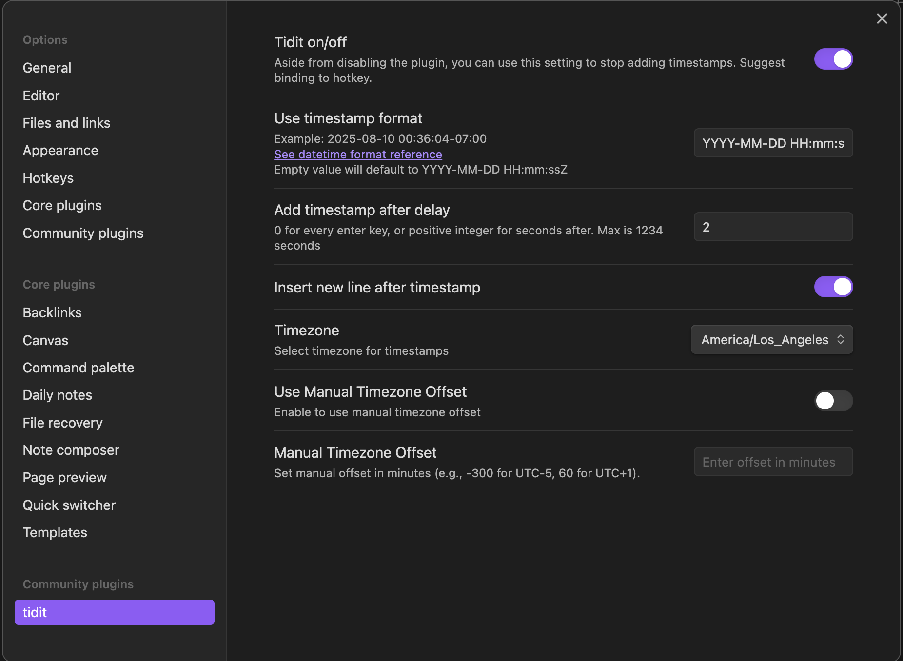
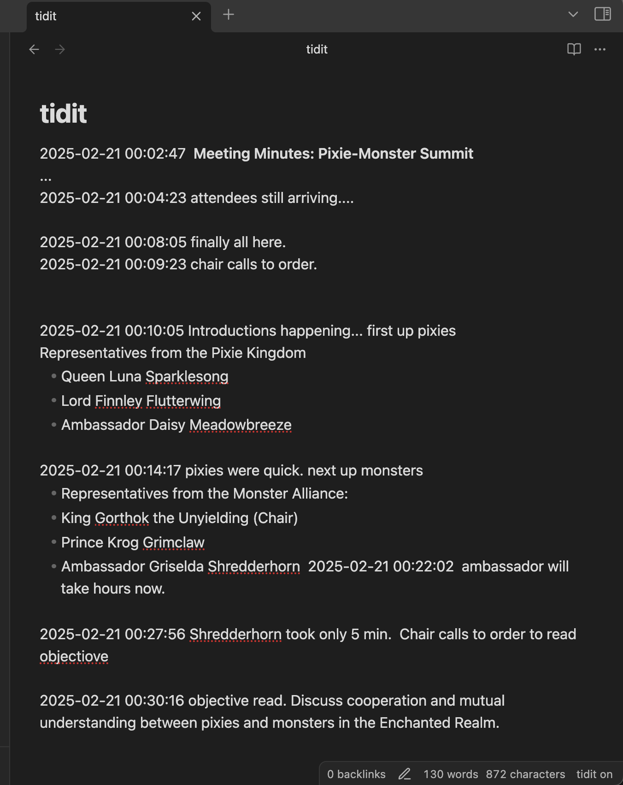
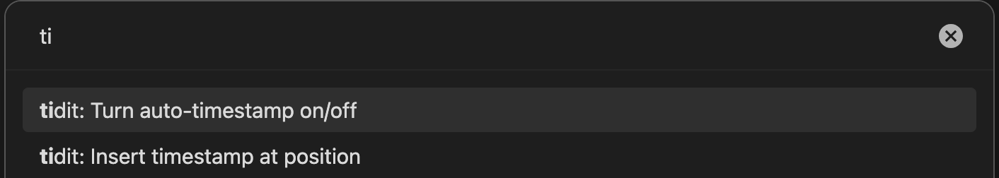

# tidit

**tidit** is an [Obsidian](https://obsidian.md/) plugin that adds timestamps to your document as you type — when you want it, how you want it, where you want it.

Install the plugin.Customize the datetime format or anything else you need. Done! Keep typing...

**tidit** includes an Obsidian command, accessible via Cmd+P (or any shortcut that opens the command menu), allowing you to quickly insert timestamps at the current cursor position in your document.

### Screenshots

#### Configuration
See https://day.js.org/docs/en/display/format for valid format options.

---

#### Example Text

---

#### Command

